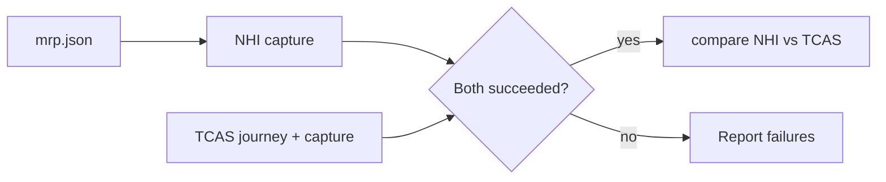

# Playwright page diff

A TypeScript Node.js CLI that captures full-page screenshots with headless Chromium
(Playwright) and compares them pixel-by-pixel, with local OCR to report what text changed.
Its main use is comparing the NHI and TCAS versions of the same Homeprotect quote page.

**Contents:** [Quick start](#quick-start) · [Commands](#commands) ·
[Configuration](#configuration) · [How quote-page works](#how-quote-page-works) ·
[Troubleshooting](#troubleshooting) · [Development](#development)

## Tech stack

- Node.js 22+, TypeScript 7 (ES modules, run with `tsx`)
- [Playwright](https://playwright.dev/) for headless Chromium capture
- [Sharp](https://sharp.pixelplumbing.com/) for image processing
- [Tesseract.js](https://github.com/naptha/tesseract.js) for local OCR
- [diff](https://github.com/kpdecker/jsdiff) for word-level text changes

## Quick start

```sh
npm install
npm run install:browser   # downloads Chromium for Playwright

# verify: should save screenshots/example.png
npm run screenshot -- https://example.com --output screenshots/example.png
```

## Commands

| Command               | What it does                                                |
| --------------------- | ----------------------------------------------------------- |
| `npm run screenshot`  | Capture a full-page screenshot of one URL                   |
| `npm run compare`     | Compare two images and report changed regions and text      |
| `npm run quote-page`  | Capture NHI and TCAS versions of one quote and compare them |
| `npm run quote-pages` | Run `quote-page` for every policy in a GUID list            |

Add `-- --help` to any command for its options (for example `npm run compare -- --help`). Failures are shown in
red and progress steps in grey; `quote-pages` shows each policy's `[n/total]` line in cyan, and
a comparison summary is green when the images are identical and yellow when they differ.

### screenshot

```sh
npm run screenshot -- https://example.com
npm run screenshot -- https://example.com --output screenshots/example.png
npm run screenshot -- https://example.com --width 390 --height 844 --wait 2000
```

| Option           | Default                      | Purpose                          |
| ---------------- | ---------------------------- | -------------------------------- |
| `-o`, `--output` | `screenshots/screenshot.png` | PNG or JPEG output (overwrites)  |
| `--width`        | `1440`                       | Viewport width in pixels         |
| `--height`       | `900`                        | Viewport height in pixels        |
| `--wait`         | `1000`                       | Extra delay (ms) after scrolling |
| `--timeout`      | `30000`                      | Navigation/action timeout (ms)   |

How it works: waits for page load, scrolls through the document to trigger lazy loading,
returns to the top, waits `--wait` ms, then captures the whole document using
[Playwright's `fullPage` option](https://playwright.dev/docs/screenshots#full-page-screenshots).

Limitations:

- The scroll pass stops after 100 viewport steps, so infinite feeds capture only what loaded.
- Independently scrolling panels and virtualised lists may need site-specific handling.
- Cookie banners and login screens are captured as shown.

### compare

```sh
npm run compare -- screenshots/before.png screenshots/after.png
npm run compare -- before.png after.png --output comparisons/my-comparison
```

| Option           | Default                       | Purpose                                                    |
| ---------------- | ----------------------------- | ---------------------------------------------------------- |
| `-o`, `--output` | `comparisons/run-<timestamp>` | Report directory (must not already exist)                  |
| `--threshold`    | `20`                          | Ignore channel differences up to this (0–255; `0` = exact) |
| `--language`     | `eng`                         | OCR language                                               |
| `--no-ocr`       | —                             | Skip text extraction                                       |

The command prints the removed and added text only for regions whose recognised text
changed, then a grey count such as `115 changed regions, 12 with text changes.` Regions that
differ only visually appear in the report, not the console. Tesseract's own diagnostics (for
example `Estimating resolution as …`) are suppressed. It writes:

| File                                        | Contents                                                 |
| ------------------------------------------- | -------------------------------------------------------- |
| `diff.png`                                  | Changed pixels highlighted in magenta                    |
| `region-N-before.png`, `region-N-after.png` | Crops of each changed region, with context               |
| `report.md`                                 | Readable visual and text comparison, with OCR confidence |
| `report.json`                               | Structured results: coordinates, text, word changes      |

Good to know:

- Accepts PNG, JPEG and any other format Sharp supports. Combined canvases over 40 million
  pixels are rejected.
- Images are compared at their original coordinates (dimensions are reported separately),
  so layout shifts can produce many differences.
- Regions group adjacent changed 32-pixel tiles plus 40 pixels of context. Nearby changes
  may share a region, and crop edges can truncate long text.
- OCR runs locally — images are never uploaded. Language data downloads on first use and
  is cached in `comparisons/.ocr-cache`.
- OCR can misread small or stylised text. Check the crops and confidence before treating a
  reported text change as definitive.

### quote-page

Captures the NHI and TCAS quote pages for one policy and compares them (NHI = before,
TCAS = after). Needs [configuration](#configuration) in `.env`.

```sh
npm run quote-page -- ABCDEF1234567890ABCDEF1234567890 42
npm run quote-page -- ABCDEF1234567890ABCDEF1234567890 42 --no-ocr
```

- **Arguments:** `<policyDetailsId> <historyId>`. The policy ID is a UUID with dashes removed
  (32 hex characters), case-insensitive and normalised to uppercase.
- **Input:** `MRP_AND_QUOTE_OUTPUT_DIR/<ID>-<historyId>-mrp.json`, whose top-level
  `artemisQuoteGuid` fills `{artemisQuoteGuid}` in the NHI URL template. The TCAS template
  uses `{policyDetailsId}` and `{historyId}`. All values are URL-encoded.
- **Output:** `screenshots/<ID>-<historyId>-nhi.png` and `-tcas.png`, plus a new timestamped
  report directory under `comparisons/`. Before capturing (once the inputs are valid), the
  previous run's output for that policy and history ID is deleted: its `-nhi`/`-tcas`
  screenshots and HTML (including `-failed` and `-declined`) and every `comparisons/` report whose
  `report.json` compares them. `quote-guid-mapping.json` is kept.

See [How quote-page works](#how-quote-page-works) for the journey, error handling and the
NHI Oops fallback.

### quote-pages

Runs `quote-page` (with `historyId` 1) for each entry in `QUOTE_GUID_LIST_PATH` — the same
list of TCAS-format policy IDs that drives `mrp-and-quote`'s `fetch`/`compare`/`diff`
commands, one per line. The matching `-1-mrp.json` files must already be fetched.

```sh
npm run quote-pages                                         # first 250 entries
npm run quote-pages -- 10                                   # first 10 entries
npm run quote-pages -- 6819e30c2058490b8d1d9e25d267b002     # one entry (case-insensitive)
npm run quote-pages -- 10 --no-ocr
```

Policies run one at a time. A failed policy is reported and the run continues. At the end,
after a blank line, a summary lists the counts and then each failed policy with its issues
indented below it (only the issues and the failed count are red):

```text
Quote pages summary
9 passed (2 both declined), 1 failed.
8230224DF66644A1A52173E3757EE8BD-1
  Quote capture failed; comparison skipped.
  NHI: Website displayed <h2>Oops</h2>; stopping the journey. (https://…)
```

The exit code is non-zero if any policy failed. A policy where
[both sides declined](#declined-quotes) counts as passed.

## Configuration

`quote-page` and `quote-pages` read settings from `.env` in the current working directory.
The committed `.env` targets the feature-dev environment.

| Variable                                      | Used by       | Purpose                                                                  |
| --------------------------------------------- | ------------- | ------------------------------------------------------------------------ |
| `MRP_AND_QUOTE_OUTPUT_DIR`                    | both          | Folder containing `<ID>-<historyId>-mrp.json` files                      |
| `QUOTE_JOURNEY_NHI_QUOTE_PAGE_URL_TEMPLATE`   | both          | NHI quote URL, with `{artemisQuoteGuid}`                                 |
| `QUOTE_JOURNEY_NHI_UNSAVED_URL_TEMPLATE`      | both          | Unsaved replacement journey URL (`nhi=false`)                            |
| `QUOTE_JOURNEY_TCAS_QUOTE_PAGE_URL_TEMPLATE`  | both          | TCAS quote URL, with `{policyDetailsId}` and `{historyId}`               |
| `QUOTE_JOURNEY_TCAS_REPLACEMENT_URL_TEMPLATE` | both          | TCAS quote summary URL for a replacement GUID, with `{artemisQuoteGuid}` |
| `QUOTE_JOURNEY_QUOTE_GUID_URL`                | both          | [NHI Oops fallback](#nhi-oops-fallback) endpoint                         |
| `QUOTE_JOURNEY_AGENT_ID`                      | both          | Fallback request `agentId`                                               |
| `QUOTE_JOURNEY_BRANCH_CODE`                   | both          | Fallback request `branchCode`                                            |
| `QUOTE_JOURNEY_CALL_MEDIA_USER`               | both          | Fallback request `callMediaUser`                                         |
| `QUOTE_GUID_LIST_PATH`                        | `quote-pages` | GUID list file, one policy ID per line                                   |

All variables listed for a command are required.

Rules:

- Existing environment variables take precedence over `.env`.
- `${VARIABLE_NAME}` references another `.env` setting or environment variable. References
  resolve recursively (forward references included); missing or circular references stop
  the command with an error.
- URL placeholders such as `{policyDetailsId}` are left alone until `quote-page` fills them.
- Relative paths resolve from the current working directory.
- URL shapes come from Quote Journey's `/api/developer/links` (for example
  `https://quotes-feature-dev.homeprotect.co.uk/api/developer/links`), which lists every entry
  point for a quote GUID or policy. Check it when adding or changing a template.

`REPO_BASE_PATH` is usually set in your environment, but you can also set it in `.env`:

```dotenv
REPO_BASE_PATH=D:/Richard/Projects/github
MRP_AND_QUOTE_OUTPUT_DIR="${REPO_BASE_PATH}/GoPackages/internal/mrp-and-quote/output"
```

## How quote-page works

NHI and TCAS run **concurrently**, and both finish even if one fails. When NHI uses a
replacement quote GUID, TCAS is captured from that GUID instead (see
[TCAS for a replacement GUID](#tcas-for-a-replacement-guid)). Failures are reported
per flow, and the comparison runs only when both captures succeed. Each flow logs every URL
it opens (`NHI: opening <url>`, `TCAS: opening <url>`), and each failure message ends with
the URL that failed.



### TCAS journey

Before capturing TCAS, the steps in `src/tcas-quote.steps.json` run in order:

1. Wait for **Cover details**.
2. Click **Contact details**.
3. Click **Get your quote**.
4. Wait for either an error summary or the welcome quote heading (any customer name,
   straight or curly apostrophes).

Edit the JSON file to change selectors or steps. Each successful step is logged in grey
with its number, action and elapsed milliseconds; a failure names the step that stopped.

After each click, the action checks for `div.av-card-error-summary`. If present, it prints
the text of each `.av-card-error-summary > ul > li > a` link (or the full summary text if
there are no links) and stops the journey and comparison.

**Cover start date auto-fix:** if Contact details reports "The cover start field needs to
be between YYYY-MM-DD ...", the action opens `svg.av-icon-calendar`, picks the calendar
`div` whose aria-label ends with that date (for example `October 2nd, 2026`), and retries
Contact details once. Any remaining errors stop the journey as usual.

### Quote summary and assumptions

The NHI quote URL and the [replacement TCAS](#tcas-for-a-replacement-guid) URL open a quote
summary, which can show these pages before its quote page, in either order, and either can
be missing. Before capturing, the action clicks through whichever appears (each click is
logged in grey) until the welcome quote heading appears, so the screenshot shows the quote
page:

| Page                                                                        | Button clicked                                                |
| --------------------------------------------------------------------------- | ------------------------------------------------------------- |
| Quote summary ("Welcome …, thank you for choosing Homeprotect", with price) | **Continue with quote** (`#hp-summary-continue-button`)       |
| Assumptions ("Are you happy with these assumptions?")                       | **Yes, take me to my quote** (`#hp-assumptions-quote-button`) |

- A page already showing the quote is captured as it is. **No, I need to make changes** is
  never clicked.
- An error summary after a click is reported (for example `NHI assumptions errors: …` or
  `TCAS quote summary errors: …`) and
  the comparison is skipped.
- The flow stops after 5 clicks without reaching the quote.

### Annual payments

Once any flow reaches the quote page, and before the screenshot, the action makes sure
**Pay annually** is selected, so NHI and TCAS are compared at the same price. If Pay monthly
is selected, it clicks `button[name="paymentSelector"][id$="~Kannually"]` (logged in grey as
`NHI: selecting Pay annually.`) and waits for `.hp-selected-box` to appear inside it; the loading
wait before capture then covers any price refresh. A quote page with no payment selector is
captured as shown, with a grey log line. If Pay annually does not become selected, the flow
fails.

### Loading screens and Oops pages

- Both flows wait for `<h2>Loading your quote</h2>` and `div.hp-loading-widget-screen` to
  disappear, and check again just before capture. Loading screens get twice the step timeout
  (60 seconds by default, against 30 for every other step); a loading screen that never clears
  fails without saving a screenshot of it.
- If a wait for the quote page times out while a loading screen is still shown, the flow logs
  `Loading screen still shown; allowing up to 30 s more.`, waits for the loading screen to
  clear within that time, and then waits for the quote page once more. A timeout with no
  loading screen fails at 30 seconds as before.
- Both flows watch for an `h2` containing exactly `Oops` from navigation through capture.
  If one appears, the flow stops, saves a failure screenshot, and skips remaining steps and
  the comparison. NHI first tries the [fallback](#nhi-oops-fallback).

### Declined quotes

The site may decline to quote ("We're sorry... but we're unable to offer you a quote based on
your details"). Both flows watch for it from navigation through capture, like Oops: a
`h1`–`h3` heading containing "we're sorry" (any apostrophe) together with the words "unable to
offer you a quote" anywhere on the page. When it appears, the flow stops and saves
`-declined.png` and `-declined.html` instead of a quote screenshot. A decline is not an Oops,
so it never triggers the [NHI fallback](#nhi-oops-fallback).

| NHI      | TCAS     | Result                                                                    |
| -------- | -------- | ------------------------------------------------------------------------- |
| quoted   | quoted   | Compared as usual                                                         |
| declined | declined | Success, not compared: `NHI and TCAS both declined the quote`             |
| declined | quoted   | Failure, not compared: `Quote outcomes differ: NHI declined, TCAS quoted` |
| quoted   | declined | Failure, not compared: `Quote outcomes differ: NHI quoted, TCAS declined` |

### Failure screenshots and HTML

If navigation or a Playwright step fails after the page opens, the current page is saved
next to the intended output with a `-failed.png` suffix (for example
`ABCDEF1234567890ABCDEF1234567890-42-tcas-failed.png`), along with its rendered DOM as
`-failed.html` (`document.documentElement.outerHTML`, so it holds what React built, not the
served source; typed input values are not included). Use the HTML to build test fixtures.
The original error is still reported. If the failure screenshot or HTML can't be saved, that
error is logged without hiding the original.

### NHI Oops fallback

When the NHI page shows `<h2>Oops</h2>`:

1. The action calls `QUOTE_JOURNEY_QUOTE_GUID_URL` (`GET /api/nhi/quote-guid`, non-live
   only) with `agentId`, `branchCode`, `callMediaUser`, `policyDetailsId` and `historyId`.
2. The endpoint copies the TCAS policy's answers onto a new quote and returns its GUID in
   the response's `guid` property. The answers are saved only in the question set store, not
   NHI or TCAS, so the NHI quote page shows Oops for the new GUID until it is quoted.
3. The new GUID is saved in `quote-guid-mapping.json` (current working directory,
   git-ignored) against the original `artemisQuoteGuid`.
4. NHI opens `QUOTE_JOURNEY_NHI_UNSAVED_URL_TEMPLATE` (`#guid=<new GUID>,nhi=false`) and
   drives the journey to its quote, which saves the quote to NHI.
5. TCAS is captured again from the new GUID, so both sides show the same answers (see
   [TCAS for a replacement GUID](#tcas-for-a-replacement-guid)).

The unsaved journey clicks **Continue** through each section (logged in grey) until
**Get your quote** appears, clicks it, and waits for the welcome quote heading. Before each
click it waits for the page's `/api/` requests and any "Checking property details" lookup to
finish.

- If Continue leaves a `div.av-card-error-summary` on a section, the flow fails with the
  section and summary text, for example `NHI journey validation failed on Property
circumstances: Enter the cost of rebuilding the property`. The copied answers need changing
  before that policy can be quoted.
- If Get your quote returns to a section (for example while the rebuild estimate is still
  being looked up), the journey is walked again once; a second return fails with the summary.
- The journey stops after 15 sections without reaching Get your quote.

Later runs try the mapped GUID's NHI quote page first; if it shows Oops (not saved to NHI
yet), the unsaved journey runs again with no further request. Delete the entry (or the whole
file) to request a fresh GUID.

```dotenv
QUOTE_JOURNEY_NHI_UNSAVED_URL_TEMPLATE="https://quotes-feature-dev.homeprotect.co.uk/#guid={artemisQuoteGuid},nhi=false"
QUOTE_JOURNEY_TCAS_REPLACEMENT_URL_TEMPLATE="https://quotes-feature-dev.homeprotect.co.uk/quotesummary#guid={artemisQuoteGuid}&source=tcas&callmediauser=${USERNAME}&bid=1066"
QUOTE_JOURNEY_QUOTE_GUID_URL="https://quotes-feature-dev.homeprotect.co.uk/api/nhi/quote-guid"
QUOTE_JOURNEY_AGENT_ID="${USERNAME}"
QUOTE_JOURNEY_BRANCH_CODE=1066
QUOTE_JOURNEY_CALL_MEDIA_USER="${USERNAME}"
```

### TCAS for a replacement GUID

A replacement quote carries the TCAS policy's answers but is a different quote, so comparing
it with the original TCAS policy would show differences. Whenever NHI captures a replacement
GUID, TCAS is captured from `QUOTE_JOURNEY_TCAS_REPLACEMENT_URL_TEMPLATE` instead — the
"TCAS Quote Summary (GUID)" entry point from `/api/developer/links`
(`quotesummary#guid=<GUID>&source=tcas`) — and clicks through its
[summary and assumptions](#quote-summary-and-assumptions) to the quote. The GUID is used
exactly as the endpoint returned it. Logs show
`TCAS: using replacement quote GUID <GUID> to match NHI.`

- **New replacement:** TCAS first runs concurrently for the original policy (the replacement
  isn't known yet), then runs again for the replacement once NHI has saved it. The second
  capture overwrites `-tcas.png`, and only its result counts.
- **Mapped replacement:** TCAS waits for NHI, then runs only for the replacement.
- Screenshot and report names keep the original policy ID and history ID.

The Quote Journey API reference is in [docs/api-documentation.json](docs/api-documentation.json)
(`/api/developer/links` is not listed there).

## Troubleshooting

- **`<NAME> must be configured in .env or the environment.`** — a required
  [variable](#configuration) is missing or empty, or a `${...}` reference didn't resolve
  (check `REPO_BASE_PATH`).
- **Browser not found / executable doesn't exist** — run `npm run install:browser`.
- **Content missing from a screenshot** — increase `--wait` for slow dynamic content, or
  `--timeout` for slow navigation.
- **`compare` fails because the output exists** — choose a new `--output` directory; reports
  are never overwritten.
- **NHI journey validation failed on &lt;section&gt;** — the copied answers fail that
  section's validation; open the URL in the message to see the error summary and fix the
  answer, or delete the mapping entry to request a new GUID.
- **NHI keeps showing Oops** — the mapped GUID in `quote-guid-mapping.json` is bad; delete its
  entry to request a new one. After a successful retry, the first attempt's
  `-nhi-failed.png` stays in `screenshots/` — this is expected.

## Development

```sh
npm run typecheck     # type check only
npm run lint          # ESLint (generated output is ignored)
npm test              # build, then run all test suites
npm run build         # compile to dist/
npm start -- screenshot https://example.com --output screenshots/example.png
```

Before calling work done, run `./VerifyProject.ps1` and check it prints `Done` with no
`FAILED at:` line. It chains the type check, tests and lint.

**Tests:** `npm test` covers screenshot, comparison, quote-page, the quote summary and
assumptions pages, output clean-up, declined quotes, the quote GUID fallback and `quote-pages`.
`scripts/tsx-watcher-test.mjs` runs the source through `tsx` (as the npm scripts do) to check
that Oops and declines appearing mid-journey still stop a capture at once. Chromium must be installed, and the
OCR test may download language data on its first run. Run a subset with `npm run test:compare` or `npm run test:quote-page` (the
latter includes `scripts/quote-summary-test.mjs` and `scripts/quote-guid-test.mjs`).

**TypeScript versions:** builds and type checks use TypeScript 7 through the
`typescript-compiler` package alias. TypeScript 6 stays installed as `typescript` for
ESLint's parser, which doesn't yet support the TypeScript 7 compiler API.

### Using the modules directly

`src/main.ts` is the CLI entry point. Each action is an importable module with typed
options; `.env` loading is handled only by the CLI.

```ts
import { screenshot } from './src/screenshot.js';
import { compare } from './src/compare.js';

await screenshot('https://example.com', { output: 'screenshots/example.png', width: 390 });
await compare('screenshots/before.png', 'screenshots/example.png', { useOcr: false });
```

- `quotePage(policyDetailsId, historyId, options)` takes the MRP directory and both URL
  templates in `options`, plus an optional `quoteGuidFallback` that enables the NHI Oops
  fallback.
- `quotePages(policyDetailsIds, historyId, options)` runs `quotePage` for each ID in turn.
